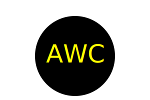

# SVGLogoMaker

## Description
This project was created as a part of a coding bootcamp. The goal was to create a SVG logo generator that runs from the command line using inquirer. This project also was to include passing tests using jest.

## Installation
Inquirer, Jest, and FS are required to run this tool.

## Usage
To use, run program with command 'node index.js' from terminal.

## Contributing
Code snippets provided as a part of bootcamp program. Extensive use of inquirer and jest documentation.

## Questions
[GitHub Profile](https://github.com/flying-tadpole)